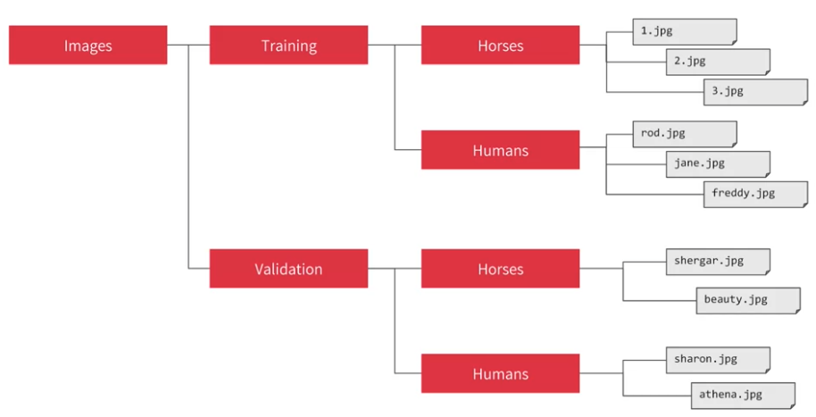
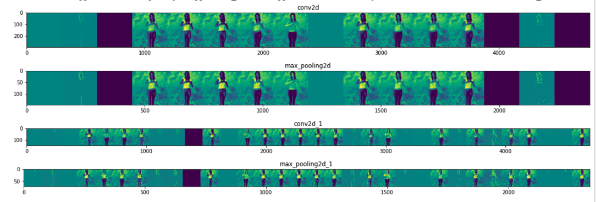

### Tensorflow

1. **Build model** ``` model = keras.Sequential([keras.layers.Dense(units=1, input_shape=[1])])```
2. **Compile**: specify **optimizer**, **loss**, **metrics** ```model.compile(optimizer='sgd', loss='mean_squared_error', metrics=['accuracy'])```
3. train_generator:


have sub-directory for training and validation, img generator will create for those images and auto label. <span style="background-color:#FFFF00">The name of subdirectory will be the label </span>




```python
from tensorflow.keras.preprocessing.image import ImageDataGenerator
# All images will be rescaled by 1./255
train_datagen = ImageDataGenerator(rescale=1/255)
# Flow training images in batches of 128 using train_datagen generator
train_generator = train_datagen.flow_from_directory(
        '/tmp/horse-or-human/',  # This is the source directory for training images, always point to directory not subdirectory
        target_size=(300, 300),  # All images will be resized to 300x300
        batch_size=128,
        # Since we use binary_crossentropy loss, we need binary labels
        class_mode='binary')


test_datagen = ImageDataGenerator(rescale=1/255)
# Flow training images in batches of 128 using train_datagen generator
validation_generator = test_datagen.flow_from_directory(
        validation_dir,
        target_size=(300, 300),  # All images will be resized to 300x300
        batch_size=32,
        # Since we use binary_crossentropy loss, we need binary labels
        class_mode='binary')
```
4. **Train model**, specify x, y, epoch, callbacks

- `steps_per_epoch = TotalTrainingSamples / TrainingBatchSize`
- `validation_steps = TotalvalidationSamples / ValidationBatchSize`

`batch_size` 和 `steps_per_epoch` 是为了spare computer memory,比如想run 一个epoch 用1024个training examples, 但computer memory 不允许，所以就每次run 128个，run 8回

  - fit: ```model.fit(xs,ys,epochs=500)```
  - fit_generator: specify directory, steps_per_epoch, epochs, verbose
 
  ```python
    history = model.fit_generator(
        train_generator, # directory
        steps_per_epoch=8, # how many steps for loading data for one epoch
        epochs=15, 
        validation_data=validation_generator, # validation data, can get loss, acc from history 
        validation_steps = 8, #When each epoch ends, the validation 
        verbose=1) # 1 is animation, 0 is no animation, 2
        # verbose = 2 hide a little animation hiding epoch progress

  ```
1. **Test model**: ```test_loss, test_acc  = model.evaluate(test_images, test_labels)```

2. **Get Accuracy and Loss**: 

```
import matplotlib.pyplot as plt
acc = history.history['acc']
val_acc = history.history['val_acc']
loss = history.history['loss']
val_loss = history.history['val_loss']

epochs = range(len(acc))

plt.plot(epochs, acc, 'r', label='Training accuracy')
plt.plot(epochs, val_acc, 'b', label='Validation accuracy')
plt.title('Training and validation accuracy')

plt.figure()

plt.plot(epochs, loss, 'r', label='Training Loss')
plt.plot(epochs, val_loss, 'b', label='Validation Loss')
plt.title('Training and validation loss')
plt.legend()

plt.show()
```

### Fashion MNIST Dataset

**fashion_mnist**: [Github](https://github.com/zalandoresearch/fashion-mnist): 


- include 70k images spread across 10 categories of clothing, image are scaled at `28 x 28` gray scale (只有一个channel, instead of 3)
- fashion_mnist dataset, 60000 of 70000 used to train, 10000 can be used for testing
- train_labels, test_labels are number rather than text, which can reduce bias 

```python
# fashion_mnist.load_data() return 4 lists
fashion_mnist = keras.datasets.fashion_mnist
(training_iamges, training_labels), (test_images, test_labels) = fashion_mnist.load_data()
```

### Callback

- callback function doesn't need to be in a separate file. 
- init will implement ```on_epoch_end``` function which get called by the callback whenever epoch ends. It aslo sends log object which contains lots of information about current state of training

```python
class myCallback(tf.keras.callbacks.Callback):
  def on_epoch_end(self, epoch, logs={}):
    if(logs.get('loss')<0.4):
      print("\nReached 60% accuracy so cancelling training!")
      self.model.stop_training = True

callbacks = myCallback()
mnist = tf.keras.datasets.fashion_mnist
(training_images, training_labels), (test_images, test_labels) = fashion_mnist.load_data()
#normalized data
training_iamges = training_images / 255.0
test_images = test_images / 255.0
model = keras.Sequential([
    keras.layers.Flatten(),
    keras.layers.Dense(128, activation=tf.nn.relu),
    keras.layers.Dense(10,activation=tf.nn.softmax)
])
model.compile(optimizer = 'adam', loss = 'sparse_categorical_crossentropy')
model.fit(training_images, training_labels, epochs=5. callbacks = [callbacks])

model.evaluate(test_images, test_labels)
classifications = model.predict(test_images)
```

### Intermidate Layer Output 

```python
import matplotlib.pyplot as plt

model = tf.keras.models.Sequential([
  tf.keras.layers.Conv2D(64, (3,3), activation='relu', input_shape=(28, 28, 1)),
  tf.keras.layers.MaxPooling2D(2, 2),
  tf.keras.layers.Conv2D(64, (3,3), activation='relu'),
  tf.keras.layers.MaxPooling2D(2,2),
  tf.keras.layers.Flatten(),
  tf.keras.layers.Dense(128, activation='relu'),
  tf.keras.layers.Dense(10, activation='softmax')
])

CONVOLUTION_NUMBER = 1
from tensorflow.keras import models
layer_outputs = [layer.output for layer in model.layers]
activation_model = tf.keras.models.Model(inputs = model.input, outputs = layer_outputs)

for i in range(0,4):
    f1 = activation_model.predict(test_images[0].reshape(1, 28, 28, 1))[i]
    plt.imshow(f1[0, : , :, CONVOLUTION_NUMBER], cmap='inferno')
    print("f1.shape",f1.shape)
"""
 f1.shape (1, 26, 26, 64)  -> Conv2D
 f1.shape (1, 13, 13, 64)  -> MaxPooling2D
 f1.shape (1, 11, 11, 64)  -> Conv2D
 f1.shape (1, 5, 5, 64)    -> MaxPooling2D
"""
```

### Visualize Intermediate Representations

```python
import numpy as np
import random
from tensorflow.keras.preprocessing.image import img_to_array, load_img

model = tf.keras.models.Sequential([
    # This is the first convolution
    tf.keras.layers.Conv2D(16, (3,3), activation='relu', input_shape=(300, 300, 3)),
    tf.keras.layers.MaxPooling2D(2, 2),
    # The second convolution
    tf.keras.layers.Conv2D(32, (3,3), activation='relu'),
    tf.keras.layers.MaxPooling2D(2,2),
    # The third convolution
    tf.keras.layers.Flatten(),
    tf.keras.layers.Dense(512, activation='relu'),
    tf.keras.layers.Dense(1, activation='sigmoid')
])

successive_outputs = [layer.output for layer in model.layers]
layer_names = [layer.name for layer in model.layers]

visualization_model = tf.keras.models.Model(inputs = model.input, outputs = successive_outputs)
# Let's prepare a random input image from the training set.
train_human_names = os.listdir(train_human_dir)
img_path = os.path.join(train_human_dir, train_human_names[0])

img = load_img(img_path, target_size=(300, 300))  # this is a PIL image
x = img_to_array(img)  # Numpy array with shape (300, 300, 3)
x = x.reshape((1,) + x.shape)  # Numpy array with shape (1, 300, 300, 3)


# Rescale by 1/255
x /= 255
successive_feature_maps = visualization_model.predict(x)

for layer_name, feature_map in zip(layer_names, successive_feature_maps):
  if len(feature_map.shape) == 4:
    # Just do this for the conv / maxpool layers, not the fully-connected layers
    n_features = feature_map.shape[-1]  # number of features in feature map
    print(layer_name, feature_map.shape)
    # The feature map has shape (1, size, size, n_features)
    size = feature_map.shape[1]
    # We will tile our images in this matrix
    display_grid = np.zeros((size, size * n_features))
    for i in range(n_features):
      #  把一个feature 都horizontal display 出来, normalize feature
      x = feature_map[0, :, :, i]
      x -= x.mean()
      x /= x.std()
      x *= 64
      x += 128
      x = np.clip(x, 0, 255).astype('uint8')
      # We'll tile each filter into this big horizontal grid
      display_grid[:, i * size : (i + 1) * size] = x
    # Display the grid

    scale = 20. / n_features
    plt.figure(figsize=(scale * n_features, scale))
    plt.title(layer_name)
    plt.grid(False)
    plt.imshow(display_grid, aspect='auto', cmap='viridis')
```

output:

```
/tmp/horse-or-human/horses/horse49-5.png
(1, 300, 300, 3)
conv2d (1, 298, 298, 16)
max_pooling2d (1, 149, 149, 16)
conv2d_1 (1, 147, 147, 32)
max_pooling2d_1 (1, 73, 73, 32)
```




### Rule of thumb:

1. **First layer** should be the same as your data(or Error), E.g. 28x28 images, 28 layers of 28 neurons is infeasible. It makes more sense to flatten 28x28 into 784x1 
2. The number of neurons in **last layer** should match the number of classes you are classifying (or Error)

### Some Link to Learn:

[learn more about bias and techniques to avoid it](https://developers.google.com/machine-learning/fairness-overview/)
 
[Fashion MNIST]( https://github.com/zalandoresearch/fashion-mnist)

[```Con2D``` and ```MaxPooling2D```](https://github.com/tensorflow/docs/tree/r1.8/site/en/api_docs) 

[Learn more convolutional 2d layer](https://www.youtube.com/playlist?list=PLkDaE6sCZn6Gl29AoE31iwdVwSG-KnDzF)

[Image Filtering](https://lodev.org/cgtutor/filtering.html) 

[Video of TensorFlow solving real-world problem](https://www.youtube.com/watch?v=NlpS-DhayQA)

[Understanding  Cross Entroy Loss](https://gombru.github.io/2018/05/23/cross_entropy_loss/)

[RMSProp Lecture Slide](http://www.cs.toronto.edu/~tijmen/csc321/slides/lecture_slides_lec6.pdf)
[RMSProp TensorFlow](https://www.tensorflow.org/versions/r1.14/api_docs/python/tf/train/RMSPropOptimizer)
         
[Horses or Humans Convnet](https://github.com/lmoroney/dlaicourse/blob/master/Course%201%20-%20Part%208%20-%20Lesson%202%20-%20Notebook.ipynb)

[Horses or Humans with Validation](https://github.com/lmoroney/dlaicourse/blob/master/Course%201%20-%20Part%208%20-%20Lesson%203%20-%20Notebook.ipynb)

[Horses or Humans with Compacting of Images](https://github.com/lmoroney/dlaicourse/blob/master/Course%201%20-%20Part%208%20-%20Lesson%204%20-%20Notebook.ipynb)

