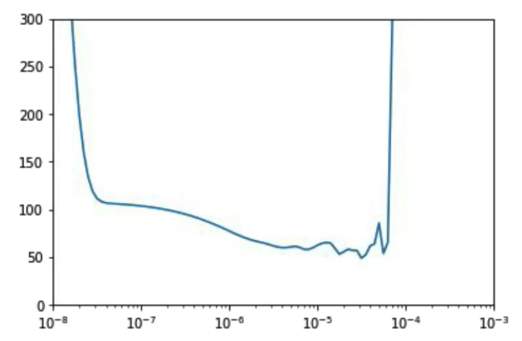

## Clear Session

Destroys the current TF graph and creates a new one.: Clear any interal variables, earlier version not affect later version of model

```python
tf.keras.backend.clear_session()
```

## Pandas Plot Autocorrelation

Note: ```series``` need to be list either built-in list or ```np.array()```

```python
from pandas.plotting import autocorrelation_plot
autocorrelation_plot(series)
```

## Evaluation Metrics

- **Errors**: difference from model and actual values over evalution period
  - ```errors = forecasts - actual``` 
- **Mean Square Error**: square to get rid of negative values
  - ```np.square(forecast - actual).mean()```
  - ```keras.metrics.mean_squared_error(forecast, actual).numpy()``` Generate the same result as above
- **Root Mean Square Error**: Make the mean of error calculation to be the same scale as original errors
  - ```rmse = np.sqrt(mse)```
- **Mean Absolute Error**: mean absolute error, also called mean absolute derivation or mad, this is not penalize large errors as mush as mse does
  - ```np.abs(forecast - actual).mean()```
  - ```keras.metrics.mean_absolute_error(forecast, actual).numpy()``` Generate the same result as above
- **Mean Absolute Percentage Error**: mean ratio between absolute error and absolute value. this gives the idea of size of errors compared to the values
  - ```mape = np.abs(errors / x_valid).mean()```:


## Generate Data From TimeSeries DataSet

```python
dataset = tf.data.Dataset.range(10)
dataset = dataset.window(5, shift=1)
for window_dataset in dataset:  #window_dataset is  WindowDataset type
  for val in window_dataset:
    print(val.numpy(), end=" ")
  print()
"""
0 1 2 3 4 
1 2 3 4 5 
2 3 4 5 6 
3 4 5 6 7 
4 5 6 7 8 
5 6 7 8 9 
6 7 8 9 
7 8 9 
8 9 
9 
"""

dataset = tf.data.Dataset.range(10)
dataset = dataset.window(5, shift=1, drop_remainder=True)
dataset = dataset.flat_map(lambda window: window.batch(5))
for window in dataset: #window is EagerTensor type
  print(window.numpy())

"""
[0 1 2 3 4]
[1 2 3 4 5]
[2 3 4 5 6]
[3 4 5 6 7]
[4 5 6 7 8]
[5 6 7 8 9]
"""

dataset = tf.data.Dataset.range(10)
dataset = dataset.window(5, shift=1, drop_remainder=True)
dataset = dataset.flat_map(lambda window: window.batch(5))
dataset = dataset.map(lambda window: (window[:-1], window[-1:]))
for x,y in dataset:
  print(x.numpy(), y.numpy())

"""
[0 1 2 3] [4]
[1 2 3 4] [5]
[2 3 4 5] [6]
[3 4 5 6] [7]
[4 5 6 7] [8]
[5 6 7 8] [9]
"""

dataset = tf.data.Dataset.range(10)
dataset = dataset.window(5, shift=1, drop_remainder=True)
dataset = dataset.flat_map(lambda window: window.batch(5))
dataset = dataset.map(lambda window: (window[:-1], window[-1:]))
dataset = dataset.shuffle(buffer_size=10)
dataset = dataset.batch(2).prefetch(1)
for x,y in dataset:
  print("x = ", x.numpy())
  print("y = ", y.numpy())

"""
x =  [[5 6 7 8]
 [2 3 4 5]]
y =  [[9]
 [6]]
x =  [[1 2 3 4]
 [3 4 5 6]]
y =  [[5]
 [7]]
x =  [[4 5 6 7]
 [0 1 2 3]]
y =  [[8]
 [4]]

"""
```

- ```dataset.shuffle(shuffle_buffer)```:  it is easy to shuffle / speed up. e.g. dataset size =  100,000  and shuffle_buffer = 1000, it will just fill the buffer with first 1000 elements, Once an element is selected,  its space in the buffer is replaced by the next (i.e. 1,001-st) element, maintaining the 1,000 element buffer. This way super large datasets, the random element choosing can choose from a smaller number which speed up effectively

```python
dataset = tf.data.Dataset.range(3)
dataset = dataset.shuffle(1, reshuffle_each_iteration=True)
dataset = dataset.repeat(2)  # doctest: +SKIP
print(list(dataset.as_numpy_iterator()))
# always yield [0, 1, 2, 0, 1, 2], 因为buffer_size 是1，1第一个element 只pick 第一个...
```

[dataset.window](https://www.tensorflow.org/api_docs/python/tf/data/Dataset#window)

```python
def windwowed_dataset(series, window_size, batch_size, shuffle_buffer):
  # batch_size is the size for training 
  # shuffle_buffer: determine how data will be shuffled
  dataset = tf.data.Dataset.from_tensor_slices(series)  
  dataset = dataset.window(window_size + 1, shift = 1, drop_remainder =  True)
  # + 1 因为 1 as label
  dataset = dataset.flat_map(lambda window: window.batch(window_size+1)) # flatten the data

  dataset = dataset.shuffle(shuffle_buffer) #dataset shuffle 组成shuffle_buffer 个 examples
            .map(lambda window: (window[:-1], window[-1:])) #(train, label) pair
  dataset = dataset.batch(batch_size).prefetch(1) # batched into selected batch size
  return dataset
```

## Train in DNN/Linear Regression

- ```tf.keras.callbacks.LearningRateScheduler```: update learning rate after each epoch by callbacks


```python
window_size = 20
batch_size = 32
shuffle_buffer_size = 1000
dataset = windowed_dataset(x_train, window_size, batch_size, shuffle_buffer_size)

# linear regression
#model = tf.keras.models.Sequential([
#    tf.keras.layers.Dense(1, input_shape=[window_size])
#])

# DNN
model = tf.keras.models.Sequential([
    tf.keras.layers.Dense(10, input_shape=[window_size], activation="relu"), 
    tf.keras.layers.Dense(10, activation="relu"), 
    tf.keras.layers.Dense(1)
])

lr_schedule = tf.keras.callbacks.LearningRateScheduler(
    lambda epoch: 1e-8 * 10**(epoch / 20))
    
optimizer = tf.keras.optimizers.SGD(lr=1e-8, momentum=0.9)
model.compile(loss="mse", optimizer=optimizer)
history = model.fit(dataset, epochs=100, callbacks=[lr_schedule], verbose=0)

tf.keras.metrics.mean_absolute_error(x_valid, results).numpy()
```


## Plot Prediction

#### Plot validation vs prediction


`numpy.newaxis` is used to increase the dimension of the existing array by one more dimension, when used once. check [this](https://stackoverflow.com/questions/29241056/how-does-numpy-newaxis-work-and-when-to-use-it) out

```python
def plot_series(time, series, format="-", start=0, end=None):
    plt.plot(time[start:end], series[start:end], format)
    plt.xlabel("Time")
    plt.ylabel("Value")
    plt.grid(True)
    
forecast = []
for time in range(len(series) - window_size):
  forecast.append(model.predict(series[time:time + window_size][np.newaxis]))
  ## np. newaxis then just reshape to input dimension that used by the model
  # or can write 
  #model.predict(series[time:time + window_size][None,:]) #变成 1 x n_features

forecast = forecast[split_time-window_size:]
results = np.array(forecast)[:, 0, 0] #forecast shape is m x 1 x 1


plt.figure(figsize=(10, 6))

plot_series(time_valid, x_valid)
plot_series(time_valid, results)
```


#### Plot Learning Rate VS Loss

```python
lrs = 1e-8 * (10 ** (np.arange(100) / 20))
plt.semilogx(lrs, history.history["loss"])
# xaxis show the learning rate and y axis show the loss
plt.axis([1e-8, 1e-3, 0, 300])
```



#### Plot loss vs epoch
```python
loss = history.history['loss']
epochs = range(len(loss))
plt.plot(epochs, loss, 'b', label='Training Loss')
plt.show()
```


## Lambda Layer

allow coder to write an arbitrary piece of code as a layer in the neural network

```python
model = tf.keras.model.Sequential([
     tf.keras.layers.Lambda(lambda x: tf.expand_dims(x, axis =-1), input_shape = [None]),
     tf.keras.layers.Bidirectional(tf.keras.layers.LSTM(32, return_sequence = True)),
     tf.keras.layers.Bidirectional(tf.keras.layers.LSTM(32, return_sequence = True)),
     tf.keras.layers.Bidirectional(tf.keras.layers.LSTM(32)),
     tf.keras.layers.Dense(1),
     tf.keras.layers.Lambda(lambda x: x * 100.0)                              
])
```


## Useful Link

[Huber Loss](https://en.wikipedia.org/wiki/Huber_loss)

[LSTM Coursera Lecture](https://www.coursera.org/lecture/nlp-sequence-models/long-short-term-memory-lstm-KXoay)

[Mini Batch Gradient Descent ](https://www.youtube.com/watch?v=4qJaSmvhxi8)

[Sunspots From KAGGLE](https://www.kaggle.com/robervalt/sunspots/)
